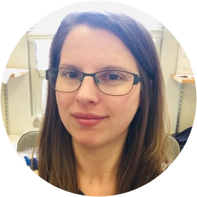
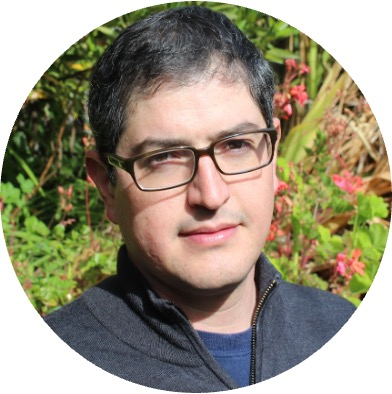
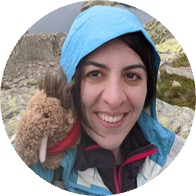
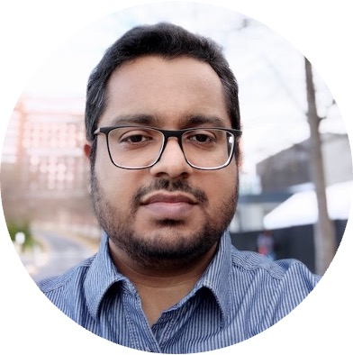

This website hosts resources and content from the virtual discussion group held at the 2022 Meeting of the Cognitive Science Society, co-organized by [Abhilasha Kumar](http://abhilashak.weebly.com/) and [Charles Kemp](http://www.charleskemp.com/).

## Panelists
 &nbsp;&nbsp;<a href="https://www.linkedin.com/in/blair-lehman-bb043b11" target="_blank">Blair Lehman</a> 
 &nbsp;&nbsp;<a href="http://www.carlosmontemayor.org/" target="_blank">Carlos Montemayor</a> 
 &nbsp;&nbsp;<a href="http://www.aidanematzadeh.me/" target="_blank">Aida Nematzadeh</a> 
 &nbsp;&nbsp;<a href="https://www.iiit.ac.in/people/faculty/Vishnusreekumar/" target="_blank">Vishnu Sreekumar</a> 

## Recording

A recording of the discussion is available <a href="https://bowdoin.zoom.us/rec/share/aFDn7vNlMbWndx_vsWViDMXyQfALl6ZmURSd1bgwRqOI9s1xQbGvkMpBZF0gnYv-.59GP6YWFI384X1Mp" target="_blank">here</a>.

## Questions/resources

Participants posted their questions on <a href="https://padlet.com/akumar85/e4a0ksvf1o4i5dg6" target="_blank">this padlet</a>, and panelists addressed the questions both during and after the session.

